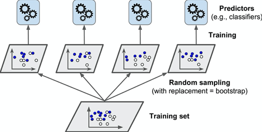
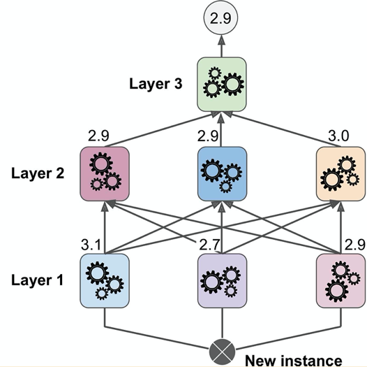

# Ensemble Learning and Random Forests

Here are some notes that I jot down from [Hands-on Machine Learning with Scikit-Learn and TensorFlow](http://shop.oreilly.com/product/0636920052289.do). 

The jupyter notebook that I ran through this part can be found here: [Jupyter Notebook](ensemble.ipynb).

## Table of Content

- [Voting Classifier](#voting_classifier)
- [Bagging and Pasting](#bagging_and_pasting)
- [Boosting](#boosting)
- [Stacking](#stacking)
- [Difference between Bagging, Boosting and Stacking](#difference)

<a name='voting_classifier'></a>

## Voting Classifier

**Ensemble**: A group of predictors.

**Voting classifier**: Aggregate the predictions of multiple classifiers and predict the class with the most votes. Usually better than any of the weak learners due to the[ law of large numbers](https://en.wikipedia.org/wiki/Law_of_large_numbers).

- **Hard voting**: Vote for majority.
- **Soft voting**: Average class probabilities and predict with the highest.

**Note**: Ensemble methods work best when the predictors are as independent from one another as possible, so one way to get diverse classifiers is to train them using very different algorithms.

#### Implementation

```python
from sklearn.ensemble import RandomForestClassifier
from sklearn.linear_model import LogisticRegression
from sklearn.svm import SVC
from sklearn.ensemble import VotingClassifier

log_clf = LogisticRegression()
rnd_clf = RandomForestClassifier()
svm_clf = SVC()

voting_clf = VotingClassifier(
    estimators=[('lr', log_clf), ('rf', rnd_clf), ('svc', svm_clf)],
    voting='hard')
voting_clf.fit(X_train, y_train)
voting_clf.predict(X_test)
```

<a name='bagging_and_pasting'></a>

### Bagging and Pasting

**Idea**: Use the same training algorithm for every predictor, but to be trained on different random subsets of the training set.



**Bagging**: The sampling is performed with replacement.

**Pasting**: The sampling is performed without replacement.

#### Advantages

- Result in a similar bias but a lower variance than a single predictor.
- Can be done in parallel, so they scale very well.

#### Implementation

```python
from sklearn.ensemble import BaggingClassifier
from sklearn.tree import DecisionTreeClassifier

bag_clf = BaggingClassifier(DecisionTreeClassifier(),
                            n_estimators=500,
                            max_samples=100,
                            bootstrap=True, # True - bagging; False - pasting
                            n_jobs=-1,
                            oob_score=True) # For automatic  oob evaluation after training
bag_clf.fit(X_train, y_train)
y_pred = bag_clf.predict(X_test)
```

#### Out-of-bag Evaluation

With bagging, only about 63% of all the training instances are sampled (some are sampled more than once) and 37% of them are never trained, so we can use them for model validation. This is called **out-of-bag (oob) evaluation.** It can be done with the bagging classifier defined above by using `bag_clf.oob_score_`.

#### Random Forest

**Random Forest** is an ensemble of decision trees, generally training via the bagging method (some are pasting), typically with max_samples set to the size of the training set. It introduces extra randomness when growing trees. Instead of searching for the best feature when splitting a node, it searches for the best feature among a random subset of features. It results in a greater tree diversity and **trade a higher bias for a lower variance**, which yields a better model.

<a name='boosting'></a>

## Boosting

**Idea**: Combine several weak learners and train predictors sequentially, each trying to correct its predecessor.

#### AdaBoost

**Idea**: Pay more attention to the training instances that the predecessor underfitted. It gives more weight to those incorrectly predicted samples, so it focuses on hard cases.


#### Gradient Boosting

**Idea**: It tries to fit the new predictor to the residual errors made by the previous predictor.

When the subsample is below 1.0, only a subset is sampled from the training instances randomly. It **trades a higher bias for a lower variance**, and speed up the training. It is called **Stochastic Gradient Boosting**.

<a name='stacking'></a>

## Stacking

**Idea**: Train models to aggregate weaker learners, instead of voting.



**Note**: Each of the block is a predictor. Also, for N layers, we need to split the training instances into N subsets. For example using the figure above, subset 1 is used to train three predictors in Layer 1; then subset 2 is passed into the them and the outputs are used to train those in Layer 2; then subset 3 is used to  pass through Layer 1 and Layer 2 and the outputs are used to train Layer 3.

<a name='difference'></a>

## Difference Between Bagging, Boosting and Stacking

https://towardsdatascience.com/ensemble-methods-bagging-boosting-and-stacking-c9214a10a205

**Bagging (Bootstrp Aggregation)**: Several instance of the same base model are trained in parallel on different bootstrap samples and then aggregated by voting (averaging). Aims for lowering variance, so suitable for low bias high variance base models.

**Boosting**: Several instance of the same base model are trained in sequence such that in each iteration, the way to train the current weak learner depends on the previous weak learner, especially on how they are performing on the data. Aims for lowering bias, so suitable for high bias, low variance base models.

**Stacking**: Different weak learners are fitted independantly from each other and a meta-model is trained on top to predict outputs from outputs returned by the base models.